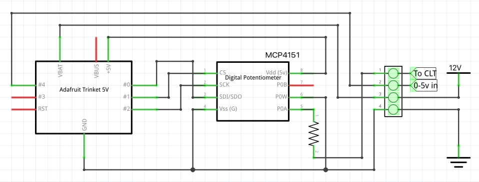

# canegt-to-ms
A simple device to translate CAN-EGT signals to Megasquirt (MS) CLT

## Why?

The [CAN-EGT device](https://thedubshop.com/can-egt/) is fantastic in that it reads and stabilizes head and exhaust temperatures and provides the data via CAN-Bus and a voltage output. Unfortunately, Megasquirt ignores this data and requires a separate "coolant" (CLT) analog input so it can know when the engine is warm. When you have an air-cooled engine, you'll need to simulate the coolant signal. The device described here will do just that.

## The Problem

The CAN-EGT provides a 0-5 volt output signal for each of its inputs.  Regardless of what is in the ini file, the output represents 0 to 1250 degrees celcius with 0 volts = 0 degrees C and 5 volts = 1250 degrees C. The device provides a nice, linear output. (The CHT should be at about 175 degrees C normally - 1250 C is past the melting point of aluminum!)

Megasquirt needs a variable resistance to ground, where a high resistance denotes a low temperature and a low resistance denotes a high temperature. The actual values are adjustable in Tuner Studio, but the low temperature must have a higher resistance than the high temperature. Another way of stating it is that higher temps are denoted with a higher current.

An analog circuit could be constructed to convert the 0-5 volts into the proper resistance to ground, but a tiny microprocessor is cheap and easier to implement. The Megasquirt input could be modified to remove the resister stack and then it could just read the 0-5 volts directly, but the Minisquirt board is difficult to modify.

## The Solution

A small, custom, cheap board that translates the CAN-EGT output to the Megasquirt CLT input. No Megasquirt or CAN-EGT modifications necessary.

### Hardware

The [Adafruit Trinket](https://www.adafruit.com/product/1501) is a $6 processor that is powered by a 5-16 volt input, has an input pin that reads precisely 0-5 volts on an input pin, can communicate with another simple chip via [SPI](https://en.wikipedia.org/wiki/Serial_Peripheral_Interface), and can provide that other chip with a stabilized 5 volts. Note that the [Trinket M0](https://www.adafruit.com/product/3500) might work and is radically easier to load code to, but it's only a 3 volt chip and other components would have to be added to translate the 0-5 volt into the 0-3 volt analog input.

[Trinket Pinouts](https://learn.adafruit.com/introducing-trinket/pinouts)

The [MCP4151-103E/P](https://www.digikey.com/en/products/detail/microchip-technology/MCP4151-103E-P/1874217) is an SPI controlled 10k ohm potentiometer in a single chip. (I picked up a [5-pack on Amazon.com](https://www.amazon.com/gp/product/B00LVKK472) for $6, but it can be found at [other sources](https://www.mouser.com/ProductDetail/Microchip-Technology/MCP4151-103E-P?qs=hH%252BOa0VZEiCcBDYaXnd0Yg%3D%3D). Make sure you buy at least two - I melted my first one by reversing the polarity!)

[MCP4151 Pinouts]()

Vdd is 3 or 5 volts (2.7 to 5.5) and Vss is ground.

Since Megasquirt does not support a 0 ohm signal, add in a 470 ohm resister in series with the potentiometer. With the Arduino program in this folder, the CLT line will get a 470 ohm signal to represent 1250 degrees C and a 10470 ohm signal will represent 0 degrees C.

### Wiring

If you haven't done any electronics tinkering and don't already have a handy set of boards, headers and terminals, it's not a bad idea to pick up [a kit](https://www.amazon.com/s?k=pcb+board+kit).

You'll need 4 connections for external wiring.

 - Variable resistance output. Wire to a 470 ohm resister, then through to the MCP4151's P0A pin (5).
 - 0-5 volt sensor input. Wire to the Trinket's pin "#4" (2nd analog input).
 - Switched 12v input. Wire directly to the Trinket's "battery" input.
 - Ground. Wire to the Trinket's ground, and the MCP4151's Vss (4) and P0W (6) pins.

Note that the 0-5v sensor input uses the same pin as the Trinket's USB. This means that you cannot connect the USB port and the sensor input at the same time. In practice, this shouldn't be an issue, but if you need to reload code be sure and disconnect the sensor input.

The [Fritzing file](CAN-EGT-2-MS.fzz) (open with [Fritzing](https://fritzing.org/)) is available if you want to print a custom circuit board. (Click the "view raw" link to download).

### Software

Use the [Arduino IDE](https://www.arduino.cc/en/Main.Software) software to connect to the Trinket via USB and load the program. Make sure you've set it up for the [Adafruit boards](https://learn.adafruit.com/add-boards-arduino-v164/setup) in order to load to the Trinket. The file to load is here: [canegt-2-ms.ino](canegt-2-ms.ino), and download it with the [raw link](https://raw.githubusercontent.com/ianepperson/canegt-to-ms/main/canegt-2-ms.ino).

There's a lot of electrical noise in the engine compartment and the input bounces around quite a bit. Since the actual value changes very slowly, the code averages the last several readings (about 2 seconds worth) to the output in order to smooth out the signal.

## Finished product

(AA battery for scale)

It's small enough that I just slipped it into a heat-shrink tube to seal it up, and it's light enough that I just tuck it in with my car's wiring.

## TunerStudio

On the "Tools" top menu, select "Calibrate Thermister Tables..." and select the "Coolant Temperature Sensor". Set it to use a "3 Point Therm Generator", then fill in the table with the resister values that your little board is providing. You'll need to do a little math here and pick some linear values between 0 and 1270 degrees. The "Bias Resister Value" is the value of the onboard resister on the Megasquirt - likely 2490 ohms.

10000 ohms / 1250 degrees celcius = 8 ohms per degree

Resistance = (10000 - Temperature X 8) + 470 ohms

| Temperature | Resistance |
| ----------- | ---------- |
| 0.0         | 10470      |
| 175.0       | 9070       | 
| 350.0       | 7670       |

It's unlikely that you'll get values this precise - note that the circuit can't step any smaller than about 39 ohms (5 degrees C) - but this broad step is a good enough indicator for the warmup logic.
